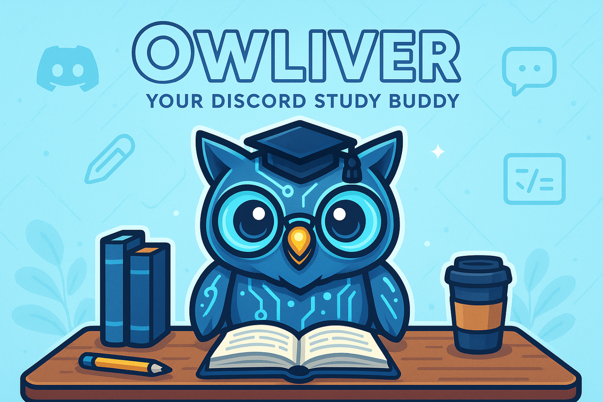

## Who is Owliver?
Owliver is a Discord Study Buddy bot based on the Owlmind framework from the Generative Intelligence Lab @ FAU. Initially envisioned as helping students study for math classes, Owliver can also be customized to help study a variety of topics. You can use everyday language with Owliver - no need for special commands.

## What can Owliver help you with today?
Within Discord's text-based interface, Owliver can:  
* Give you practice math problems
* Give hints, step you through, or provide the solution for how to solve a given math problem
  * You can change how much help Owliver will provide by including that in your request
* Describe different math concepts at different levels
* Provide help with navigating Owliver's capabilities

Coming soon: Screenshots of the Owliver prototype in action

## Owliver's Future
Future development areas include:  
* Progress tracking
  * Example Use Case: Allowing a student to see statistics both within and between study sessions (ex: number of problems practiced, percentage of correct responses, number of attempts, etc.)
* Adding additional context for LLMs to refer back to earlier conversation threads
  * Example Use Case: A student requesting the solution to a math problem provided by Owliver
  * Example Use Case: Preventing Owliver from generating problems that are identical or too similar within a given time frame/conversation
* Support for file generation and acceptance
  * Example Use Case: A student can provide a screenshot of a math problem they are working on (whether by hand or digitally) for Owliver to assist with, eliminating the need to format the equation in a manner that Discord's text interface can accept
  * Example Use Case: Owliver can provide an image of a lengthier problem in a more user-friendly format than the Discord text interface allows, for example with LaTeX formatting
* Support for requesting help in the future
  * Example Use Case: A student can ask Owliver to generate a practice test for a subject three days before an upcoming test that will then be provided in Discord on the specified date and time, rather than immediately

## Creating Your Own Owliver
So you want to create your own Owliver? Awesome! 

You can use the links below to learn how to get started with the Owlmind framework. These instructions come directly from the Owlmind framework's GitHub. The only difference is you will want to clone the Owliver repo instead of the Owlmind repo, since Owliver will give you access to an Owliver-specific rule set.

Below you will also find links to the current version of the Owlmind framework, as well as other projects from the Generative Intelligence Lab @ FAU.

### [Understand](./OWLMIND_SETUP.md) | [Get Started](./OWLMIND_SETUP.md#getting-started) | [Owlmind](https://github.com/genilab/owlmind) | [The Generative Intelligence Lab @ FAU](https://github.com/genilab)

## Owliver's Team
Owliver has been developed by the Three Owls in a Trench Coat team in Dr. Fernando Koch's Spring 2025 CEN 4010 Principles of Software Engineering class.

[Click here to find out more about the Generative Intelligence Lab @ FAU](https://github.com/genilab)
